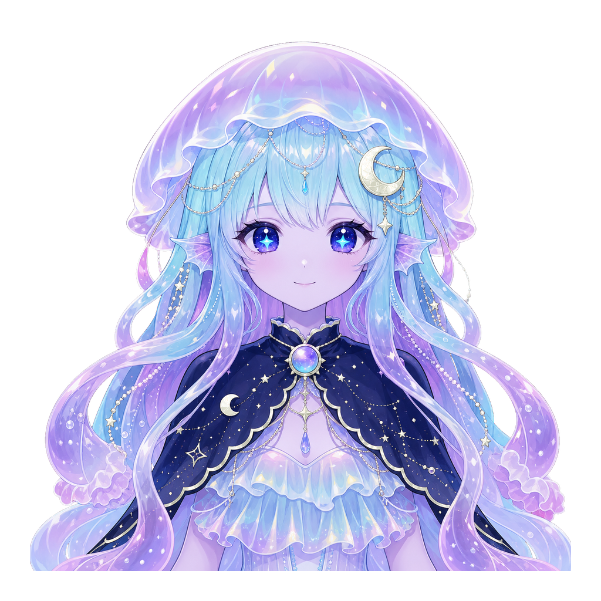
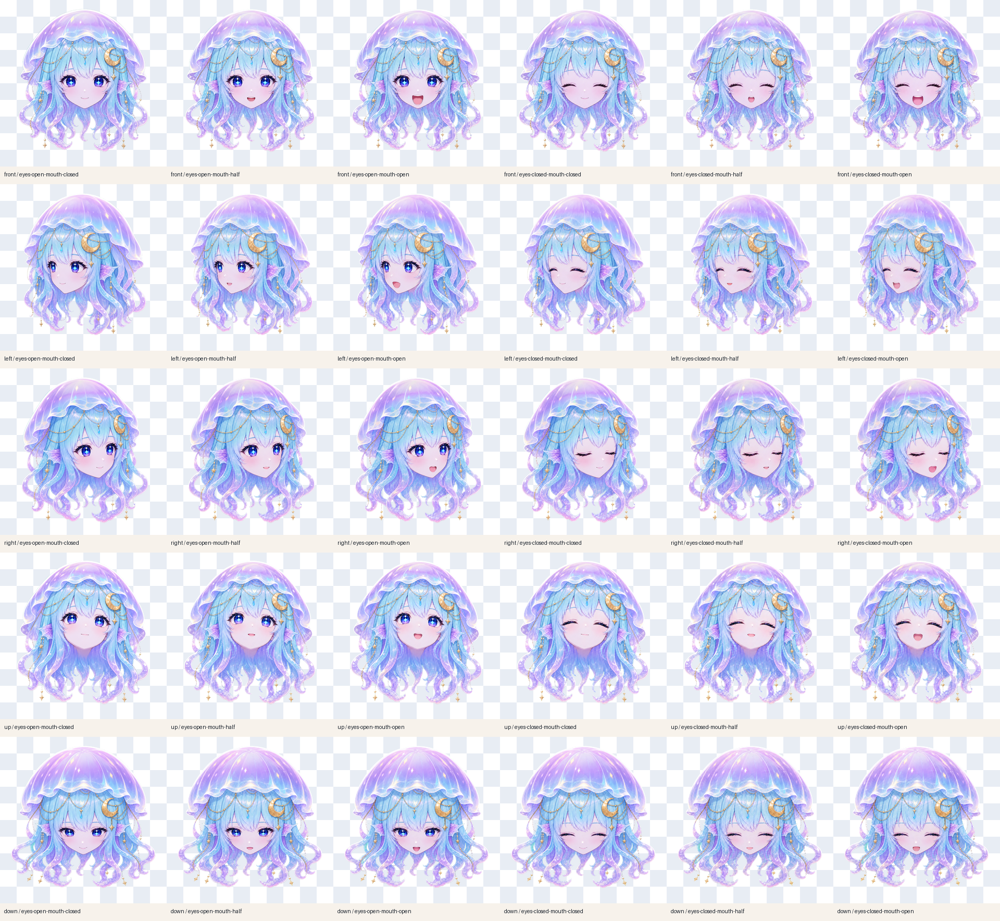
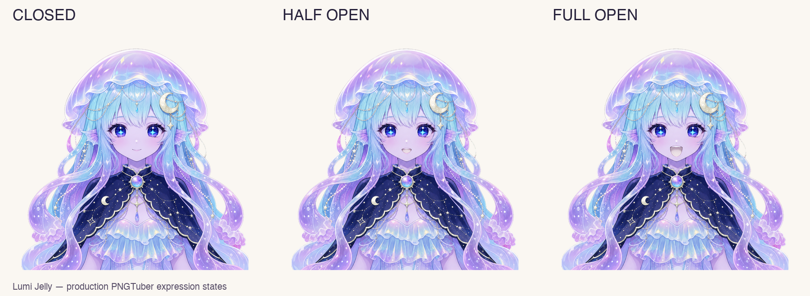

# PuruPuru PNGTuber向け Lumi Jelly

[English](./README.md) | [日本語](./README.ja.md)

天体クラゲをモチーフにしたオリジナルPNGTuberキャラクターです。通常版と、
頭部のみで正面・左・右・上・下へ動く5方向版の2種類を収録しています。
Image Genの生成元と加工履歴を保存し、PuruPuru PNGTuber実機で確認済みです。

<p align="center">
  
</p>

## 頭部のみの5方向モーション版

`Lumi Jelly Head Motion` には首、肩、胴体、衣装、胸部がありません。
左・右・上・下の各マスターは、承認済みの正面マスターを直接参照して
Image Genで個別生成しました。反転、Canvasワープ、別方向からの派生は
使用していません。

正面を含む5方向それぞれに「開眼／閉眼 × 口閉じ／半開き／全開き」の
6状態があり、合計30枚の実行用PNGを収録しています。



アプリは常に優勢な方向のImage Gen画像1枚だけを描画します。140msの
方向ウェイト追従で入力のばたつきを抑えつつ、全面クロスフェードを行わない
ため、高速操作でも二重目や二重口が発生しません。


## 通常版プレビュー



通常版も、開眼／閉眼と口3段階を組み合わせた6枚の透過PNGを収録しています。
すべて `1024 × 1024` で整列済みです。

## PuruPuru PNGTuberへの導入

1. [PuruPuru PNGTuber](https://github.com/rotejin/PuruPuruPNGTuber) をクローンします。
2. このリポジトリで、対象クローンの絶対パスを指定して実行します。

   ```bash
   ./tools/install_into_purupuru.sh /absolute/path/to/PuruPuruPNGTuber
   ```

3. 対象側で `./run_local_server.sh` を起動し、キャラ切替から
   **Lumi Jelly** または **Lumi Jelly Head Motion** を選びます。

統合パッチは上流タグ `v0.1.0`（`9dc1e73`）向けです。新規クローンへの
導入後、静的テスト52件と `node --check app.js` が通ることを確認しています。

## リポジトリ構成

```text
avatar/                 通常版の実行用PNGと設定
provenance/             通常版の未加工Image Gen出力と中間PNG
head-motion/avatar/     頭部5方向版、30状態、生成元、中間PNG、設定
docs/screenshots/       実アプリ確認画像、原寸QA、方向往復GIF
tools/                  再生成・導入ツール
integration/            PuruPuru統合パッチと対象側スクリプト
SHA256SUMS              公開ファイルの整合性マニフェスト
```

旧Canvasワープの診断画像と、採用しなかった低品質SVG試作は公開物から
除外しています。

## 実行用PNGの再構築

```bash
python3 -m pip install Pillow
./tools/render_lumi_jelly_assets.sh
./tools/render_lumi_head_motion_assets.sh
```

再構築で行うのは、クロマ除去済み中間PNGのリサイズ、透過パディング、
互換レイヤー生成、QA一覧生成です。生成キャラクターをコード描画で
置き換える処理はありません。

## 来歴

- OpenAI組み込みImage Genを使用して2026-07-15〜16に制作。
- 頭部5方向版の各方向マスターは、正面マスターを直接参照して生成。
- 未加工出力、透過化中間、プロンプト記録、方向の参照関係をリポジトリ内に保存。
- ローカル処理はクロマ除去、パディング、リサイズ、パッケージ化のみ。
- 特定の既存キャラクター、作家名、第三者キャラクター素材は参照していません。

## ライセンス

- キャラクター画像と生成元: [LICENSE-ASSETS.md](./LICENSE-ASSETS.md)
- `tools/` と `integration/` のコード: [LICENSE-CODE](./LICENSE-CODE)
- 対象アプリ: masa氏の [PuruPuru PNGTuber](https://github.com/rotejin/PuruPuruPNGTuber)

生成物に関するユーザーとOpenAIの関係にはOpenAIの規約が適用されます。
各法域での著作権成立や第三者権利非侵害を保証するものではありません。
