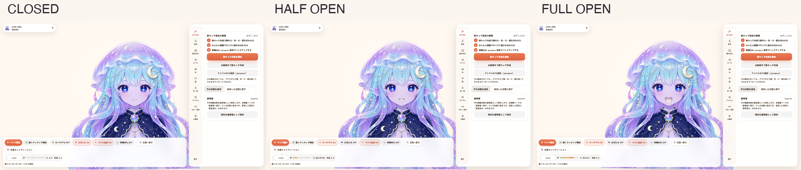

# Lumi Jelly for PuruPuru PNGTuber

An original celestial jellyfish PNGTuber character with six production-ready
expression states, preserved Image Gen sources, and verified PuruPuru PNGTuber
compatibility.

<p align="center">
  
</p>

<p align="center">
  
  
  
  
</p>

## Preview


Closed, half-open, and fully open mouth states are supplied for both open and
closed eyes. All runtime PNG files share the same transparent `1024 × 1024`
canvas and alignment.

## Verified in the app



The final build was checked in the real app UI:

- character profile: `Lumi Jelly / 保存済み`;
- closed mouth: `口: とじ`;
- half-open mouth: `口: はんびらき`;
- fully open mouth: `口: ぜんかい`;
- 51 upstream integration tests passed; and
- an independent full-resolution visual audit passed.

## Use with PuruPuru PNGTuber

1. Clone [PuruPuru PNGTuber](https://github.com/rotejin/PuruPuruPNGTuber).
2. Run the installer with the absolute path to that checkout:

   ```bash
   ./tools/install_into_purupuru.sh /absolute/path/to/PuruPuruPNGTuber
   ```

3. Start PuruPuru PNGTuber with `./run_local_server.sh` and select
   **Lumi Jelly** from the character switcher.

The patch adds automatic profile registration and the corresponding static
tests. It was produced against upstream tag `v0.1.0` (`9dc1e73`). If upstream
changes make the patch fail, use the files in `avatar/` as the authoritative
character package and port the small registration block manually.

## Repository contents

```text
avatar/                 Runtime PNGs, settings, concept, expression preview
provenance/source/      Untouched Image Gen outputs on chroma background
provenance/keyed/       Background-removed intermediate PNGs
provenance/PROMPTS.md   Master and identity-preserving edit prompts
tools/                  Normalization and installation utilities
integration/            Context-checked PuruPuru patch (`.patch.gz`) and target scripts
docs/screenshots/       Final full-app verification evidence
SHA256SUMS              Integrity manifest for published files
```

The rejected low-quality SVG experiment and failed diagnostic screenshots are
intentionally excluded from this public repository.

## Rebuild runtime PNGs

The keyed intermediates can be normalized back into the aligned runtime files:

```bash
python3 -m pip install Pillow
./tools/render_lumi_jelly_assets.sh
```

This step performs resizing, transparent padding, and compatibility-layer
generation only. It does not redraw or replace the Image Gen character.

## Provenance

- Created on 2026-07-15 with OpenAI's built-in Image Gen tool.
- One approved master was edited with identity-preserving prompts to create six
  eye/mouth states.
- Untouched outputs and exact prompt records are retained under `provenance/`.
- Runtime processing is limited to chroma-key removal, padding, and resizing.
- No named artist, existing character, or third-party character asset was used
  as a prompt reference.

## License and credits

- Lumi Jelly artwork and image sources: see [LICENSE-ASSETS.md](./LICENSE-ASSETS.md).
- Code under `tools/` and `integration/`: Apache License 2.0, see
  [LICENSE-CODE](./LICENSE-CODE). Upstream-derived patch context retains its
  upstream attribution.
- Target app: [PuruPuru PNGTuber](https://github.com/rotejin/PuruPuruPNGTuber)
  by masa. The app is not bundled here.

OpenAI's terms govern the relationship between the user and OpenAI for the
generated output; they do not guarantee copyright availability or third-party
non-infringement in every jurisdiction.
